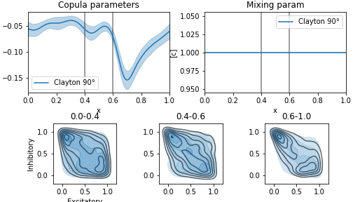

# Parametric Copula-GP framework

This is the GPyTorch-based package that infers copula parameters using a latent Gaussian Process model.
The package contains 4 copula families (Gaussian, Frank, Clayton, Gumbel) + linear combinations of copulas from same or different families.
The models are constructed with the greedy or heuristic algorithm and the best model is selected based on WAIC. 
Both greedy and heuristic algorithms perform well on synthetic data (see tests/integration).
The bivariate models can be then organised into a C-Vine.
A number of methods for computing information measures (e.g. vine.entropy, vine.inputMI) are implemented.
For a complete description of our method, see our paper (link below).

# Installing the package from PyPI

```
pip install copulagp
```

# Installing the package from Github repo

In a virtual environment (e.g. [virtualenv](https://pypi.org/project/virtualenv/)), install all the dependencies and the package using the following commands:
```
pip install -r requirements.txt
pip install .
```

# Getting started

Let us start with importing pytorch and loading some data (e.g. the synthetic neuronal data generated with a GLM model, Fig3 in our pre-print):
```
import torch
import pickle as pkl
with open("./notebooks/started/GLM_generated_data.pkl","rb") as f:
    data = pkl.load(f)
```

Next, we use fastKDE to transform the marginals:
```
import copulagp.marginal as mg
y = torch.zeros(data['Y'].shape)
for i in range(2):
    y[i] = torch.tensor(mg.fast_signal2uniform(data['Y'][i],data['X']))
```

Next, let us try a Clayton copula model on this data (optionally: on a GPU; should take around 30 seconds)
```
import copulagp.bvcopula
device='cuda:0'
train_x = torch.tensor(data['X']).float().to(device=device)
train_y = y.T.float().to(device=device)

likelihoods = [bvcopula.ClaytonCopula_Likelihood(rotation='90°')]
(waic, model) = bvcopula.infer(likelihoods,train_x,train_y,device=device, prior_rbf_length=2.0)
print(f"WAIC: {waic}") # waic = -0.119
```

Let us plot the results, using a plot helper Plot_Fit for this:
```
from copulagp.utils import Plot_Fit
Plot_Fit(model, data['X'], y.numpy().T,'Excitatory', 'Inhibitory', device);
```


We can then sample from the GP model and calculate the conditional entropy of the copula model. This copula entropy is equivalent to the mutual information between two variables. Using sampling from a GP, we obtain confidence intervals for this mutual information:
```
import matplotlib.pyplot as plt
test_x = torch.linspace(0,1,200).float().to(device=device)
entropies = torch.zeros(10,200)
for i in range(10): 
    f = model.gp_model(test_x).rsample(torch.Size([1])) # sample from a GP
    copula = model.likelihood.get_copula(f.squeeze()) # initialize a copula, parameterized by that GP sample
    entropies[i] = copula.entropy(sem_tol=0.01, mc_size=1000).cpu() # calculate entropy
entropies = entropies.numpy()

plt.plot(test_x.cpu().numpy(),entropies.mean(0))
plt.fill_between(test_x.cpu().numpy(),entropies.mean(0)-entropies.std(0),entropies.mean(0)+entropies.std(0),alpha=0.2)
```


Note, that Clayton copula is not the best fitting model for this example. We can find the best one by using one of the model selection algorithms (e.g. heuristic):

```
import copulagp.select_copula
(store, waic) = select_copula.select_with_heuristics(data['X'],y.numpy().T,device,'cond',\
                                            './','Excitatory','Inhibitory',train_x=train_x,train_y=train_y)
print(f"Best model: {store.name_string}, WAIC: {waic}") # best_waic = -0.139
```

The best copula found by the heuristic algorithm is a mixture of Frank and Clayton. We can visualize this model and calculate it's entropy using the same code as for the Clayton copula (see the results in notebooks/Getting_started.ipynb).

More notebooks with examples and the code that generated the figures for our paper can be found in notebooks/.

# Citation

If you find our Copula-GP package useful, please consider citing our work:

```
@article{kudryashova2022parametric,
  title={Parametric Copula-GP model for analyzing multidimensional neuronal and behavioral relationships},
  author={Kudryashova, Nina and Amvrosiadis, Theoklitos and Dupuy, Nathalie and Rochefort, Nathalie and Onken, Arno},
  journal={PLoS computational biology},
  volume={18},
  number={1},
  pages={e1009799},
  year={2022},
  publisher={Public Library of Science San Francisco, CA USA}
}
```